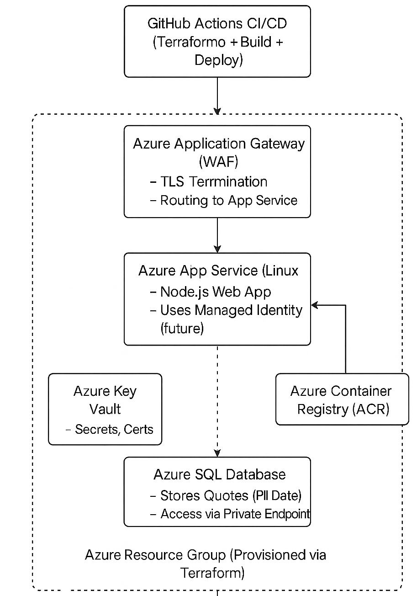
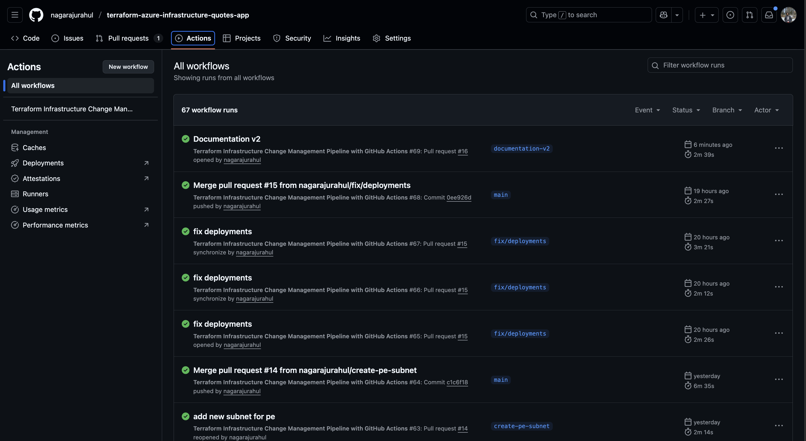
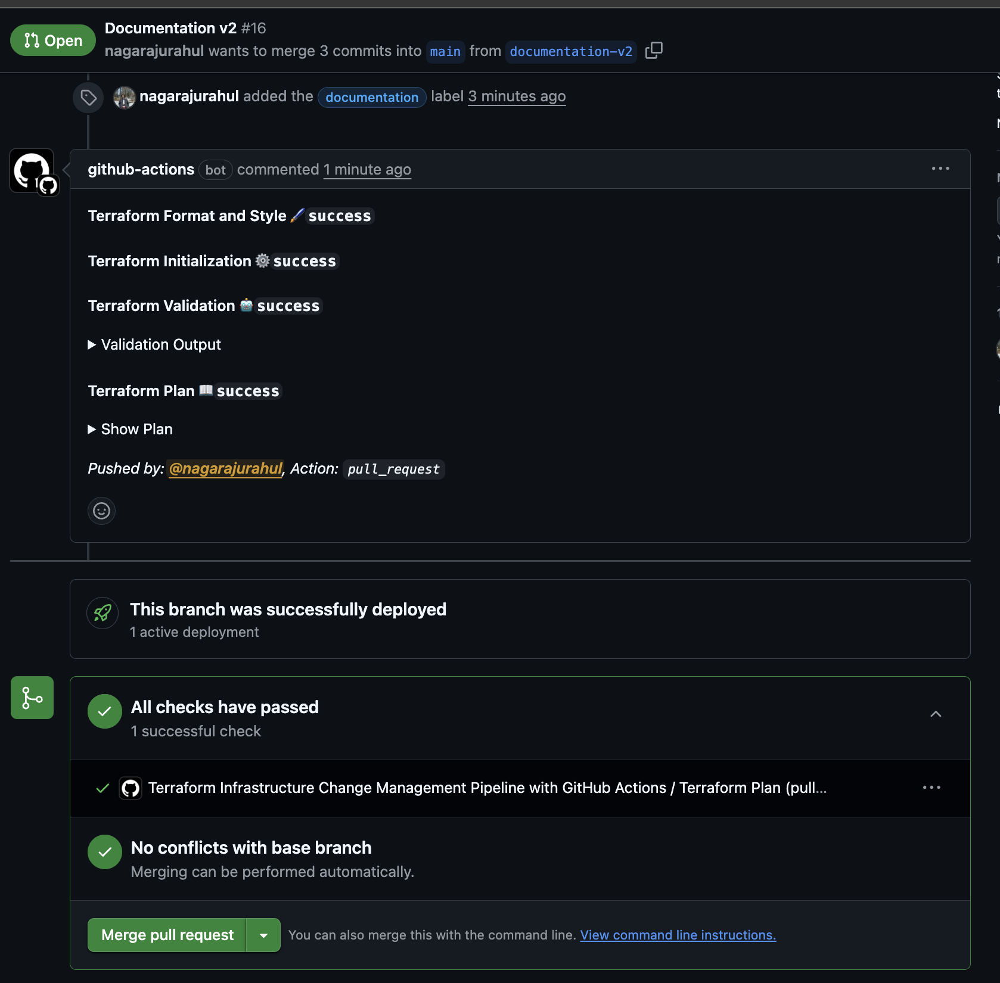
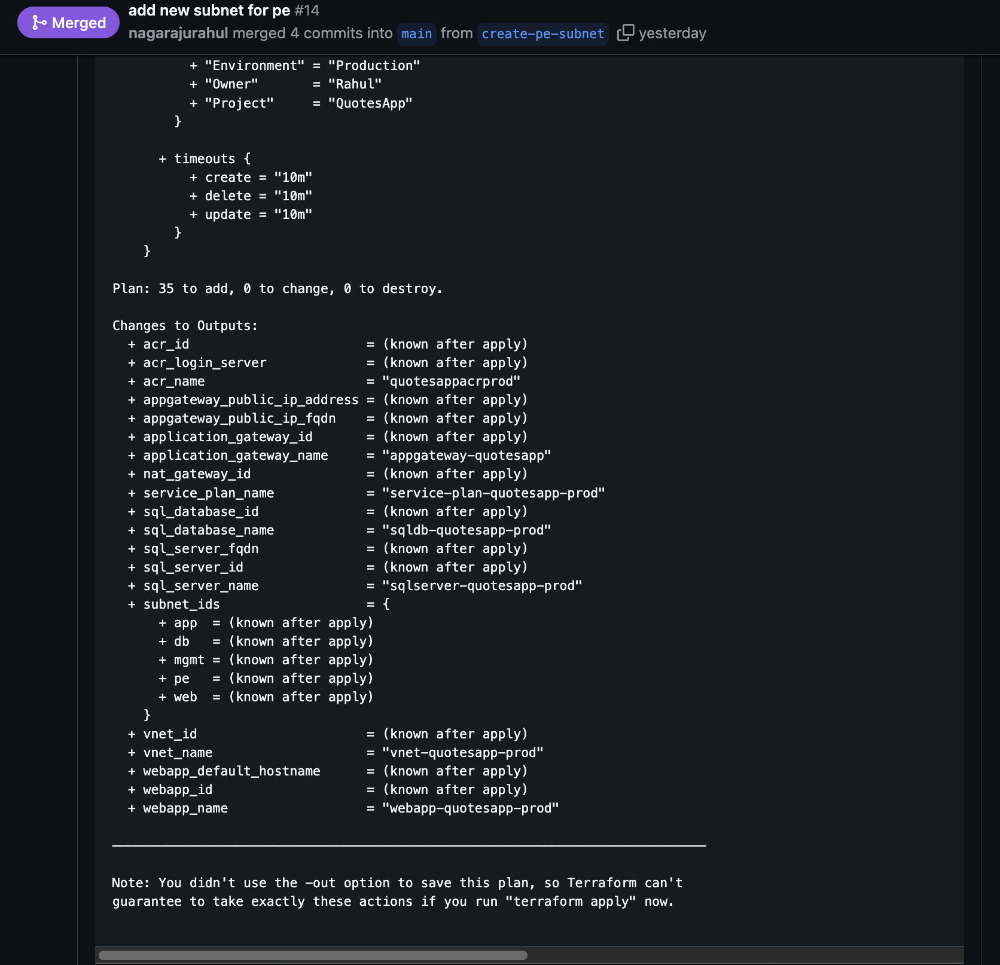
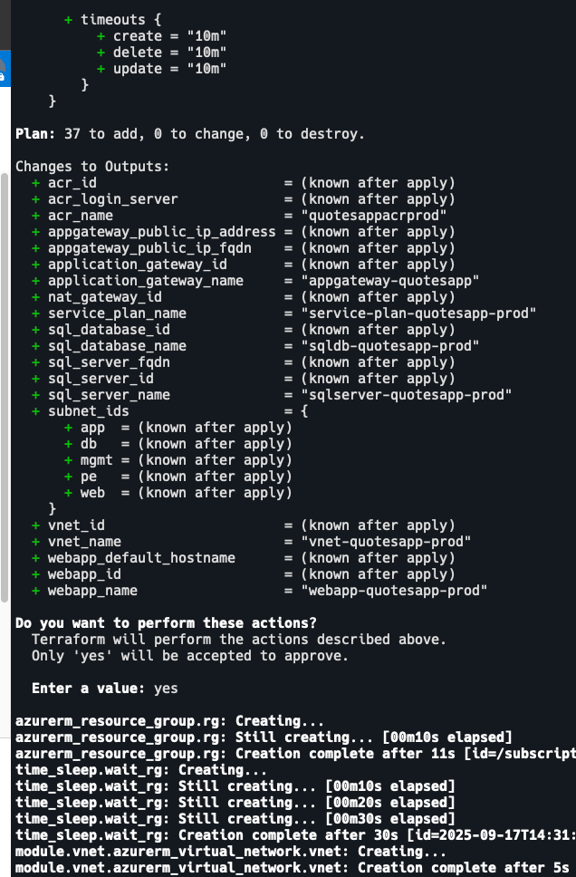
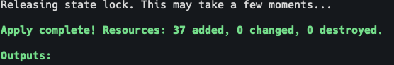
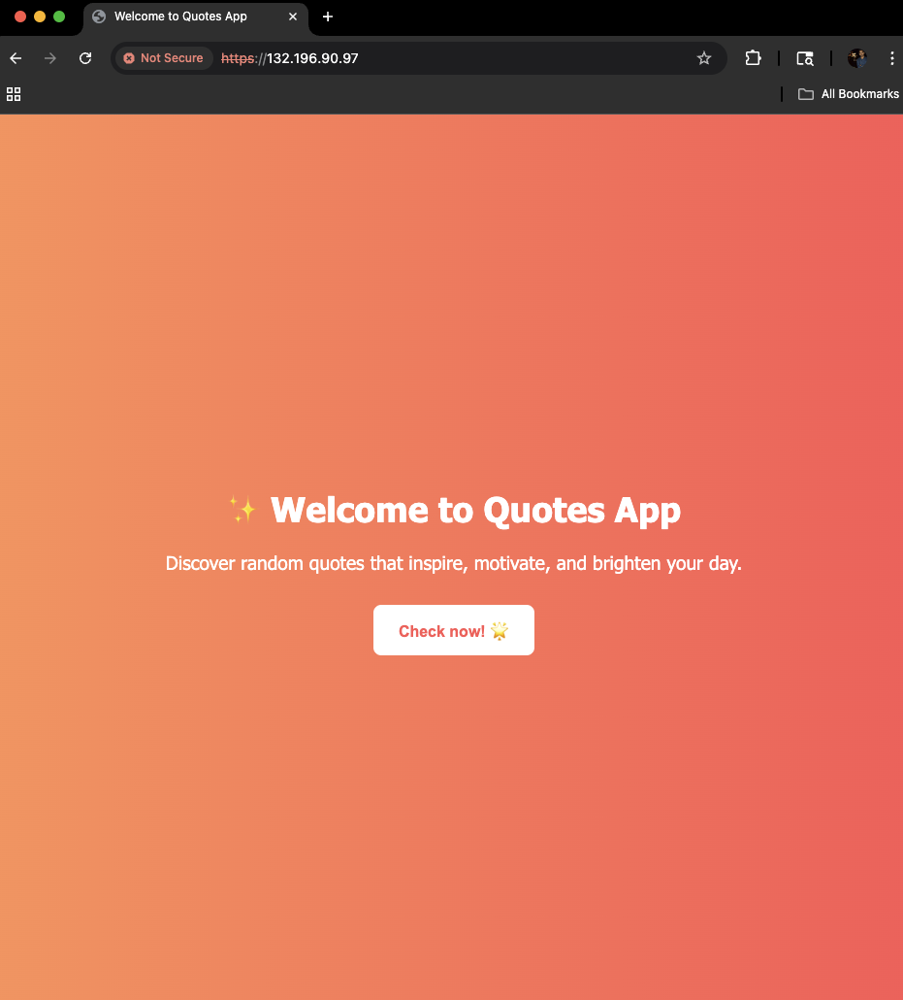
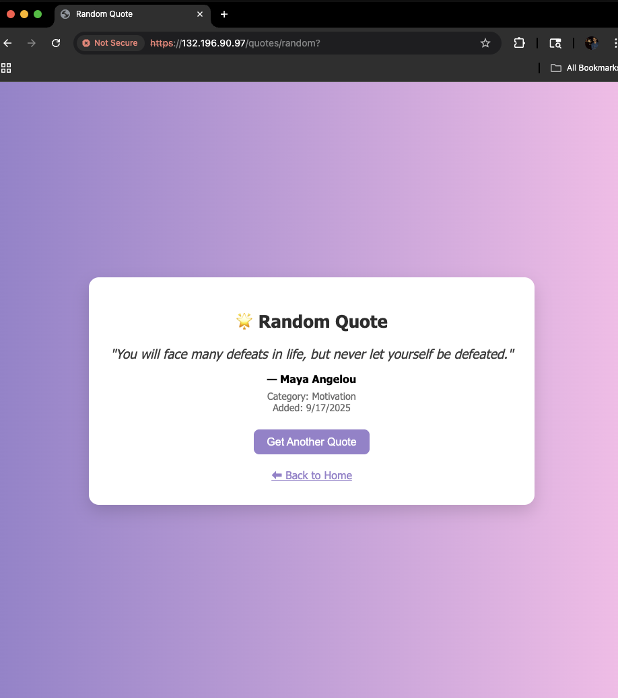
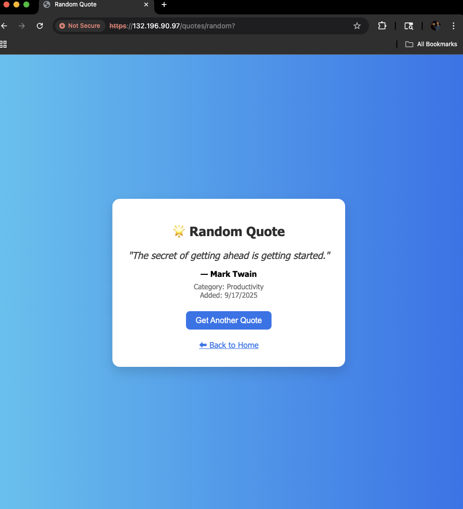

# Assessment Documentation

## Table of Contents

- [1. Summary](#1-summary)
- [2. Introduction](#2-introduction)
- [3. Requirements](#3-requirements)
- [4. Architecture](#4-architecture)
- [5. Infrastructure Design](#5-infrastructure-design)
- [6. CI/CD & Automation](#6-cicd--automation)
- [7. Testing & Validation](#7-testing--validation)
- [8. Best Practices & Standards Applied](#8-best-practices--standards-applied)
- [9. Risks & Mitigations](#9-risks--mitigations)
- [10. Conclusion & Next Steps](#10-conclusion--next-steps)
- [10.1 Future Improvement](#101-future-improvements)
- [10.2 Challenges faced](#102-challenges-faced-during-project-implementation)
- [11. Appendix](#11-appendix)
- [12. Images & Diagrams (Screenshots)](#12-images--diagrams)

## 1. Summary

**Project Name:** Quotes App – Secure, Highly Available Public Web Application with Azure SQL DB on Azure

**Objective:**  
Design, build, and deploy a public-facing Node.js web application that fetches random quotes from an Azure SQL database, ensuring end-to-end security, compliance, and automation.

**Scope:**  
- Full Infrastructure as Code with Terraform.
  - Remote state management in Azure Storage with Locks
  - Structured modules
  - Reusability across multiple teams/projects

- CI/CD pipeline with GitHub Actions.
  - Branch protection for production branch on production
  - Merge only after review and approval from senior
  - Deploy to prod trigerred only after multiple approvals

- Secure networking with private endpoints.
  - Data transimitted internally over private network in Azure

- PII-compliant SQL database.

- TLS, HTTPS, WAF, and Audit 
  - Encryption at rest and in-transit.

- Key Vault-based secret management.
  - No Harcoded Secrets

---

## 2. Introduction

**Problem Statement:**  
Need for a highly available, secure cloud solution for a public-facing web app with secure PII data in the database.  

**Business Value:**  
Demonstrates cloud automation, scalability, and compliance.  

**Stakeholders:**  
Cloud engineering team.  

---

## 3. Requirements

### 3.1 Functional Requirements
- Web app fetches and displays a random quote.  
- Quotes database seeded automatically.  
- Custom domain + HTTPS enabled.  
- App Service runs Node.js application.  

### 3.2 Non-Functional Requirements
- **Availability:** 99.9% SLA with redundancy.  
- **Security:** PII protection, private networking, TLS 1.2+.  
- **Performance:** Fast query response from SQL.  
- **Scalability:** App Service scaling enabled.  
- **Compliance:** Follows HIPAA/GDPR-like controls.  

---

## 4. Architecture

### 4.1 High-Level Architecture Diagram

### 4.2 Components
- **Azure App Service:** Hosts Node.js app (Linux).  
- **Azure SQL Database:** Stores quotes (critical PII).  
- **Azure Application Gateway:** Provides WAF, TLS termination, routing.  
- **Azure Key Vault:** Stores secrets & certificates.  
- **Private Endpoints + DNS Zones:** Secure app service and database connectivity.  
- **Terraform:** Infrastructure as Code (IaC).  
- **GitHub Actions:** CI/CD pipeline for automation.  

---

## 5. Infrastructure Design

### 5.1 Networking
Virtual Network with 4 subnets:  
- Web Subnet (App Gateway)  
- App Subnet (App Service)  
- DB Subnet (Private Endpoint) 
- PE Endpoint (Other Private Endpoint such as App Service, Vault etc) 
- Management Subnet (Management VMs)  

### 5.2 Security
- No public SQL access (private endpoint only).  
- Web App public access disabled → only App Gateway entry point.  
- Managed Identity for App Service to access SQL DB.  
- TLS 1.2 enforced end-to-end.  

---

## 6. CI/CD & Automation

### 6.1 GitHub Actions Workflow
- **Check Infra Config:** Terraform fmt, validate, plan
- **Deploy Infra:** Terraform apply.  
- **Build:** Node.js app containerized and pushed to ACR.  
- **App Server:** Pulls uploaded container from ACR via Identity.  
- **Database Seed:** SQL seed script run via pipeline.  

### 6.2 Secrets Management
- GitHub secrets → Azure Key Vault → Terraform.  

---

## 7. Testing & Validation
- **Connectivity Tests:** `curl` via App Gateway → returns quote.  
- **Database Tests:** Seeded quotes query returns data.  
- **Security Tests:** App Service not directly accessible, only via Gateway.  
- **TLS Tests:** HTTPS enforced with valid certificate.  

---

## 8. Best Practices & Standards Applied
- Infrastructure as Code with Terraform -> versioned, repeatable.  
- Network isolation with private endpoints.  
- Zero hardcoded credentials (Managed Identity + Key Vault).  
- High availability with App Gateway & App Service scaling.  
- PII data secured with encryption in transit and at rest.  

---

## 9. Risks & Mitigations
- **Misconfigured Networking:** Private DNS zone linking tested.  
- **Secret Leakage:** All secrets stored in Key Vault.  
- **Scaling Costs:** Auto-scaling thresholds defined.  

---

## 10. Conclusion & Next Steps
- Successfully deployed a production-ready architecture.  

### 10.1 Future Improvements

  - Add monitoring (App Insights, Log Analytics).  
  - Enable autoscaling.  
  - Implement disaster recovery (Geo-replication).  
  - Add WAF and Azure Front Door for global resiliency.  
  - Replace password authentication with Managed Identity via Azure AD.  
  - For microservice-based services, consider AKS (Azure Kubernetes Service).  
  - Integrate Azure DevOps for streamlined identity & access management.  

### 10.2 Challenges faced during project implementation

Challenges faces while implementation - See [challenges.md](./others/challenges.md) for details.

---

## 11. Appendix
- Terraform Code – GitHub repo  
- GitHub Actions Pipeline YAML  
- SQL Seed Script  
- Screenshots of working web app  

## 12. Images & Diagrams

This section contains reference diagrams and screenshots to illustrate the infrastructure and application setup.

### 12.1 Architecture Diagram

### 12.2 CI/CD Workflow - GitHub Actions

### 12.3 PR - CI/CD validation trigger

### 12.4 Git Bot Outputs for CI/CD validation

### 12.12 Terraform Apply

### 12.6 Application Screenshot

### 12.7 Random Quotes Screenshot

